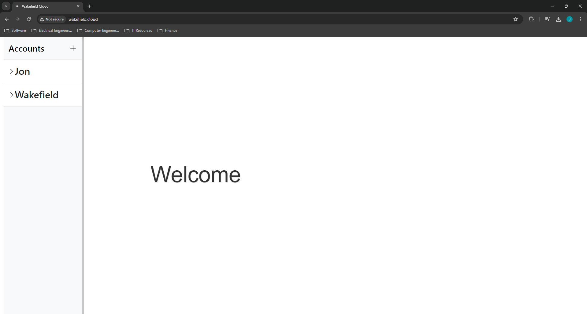
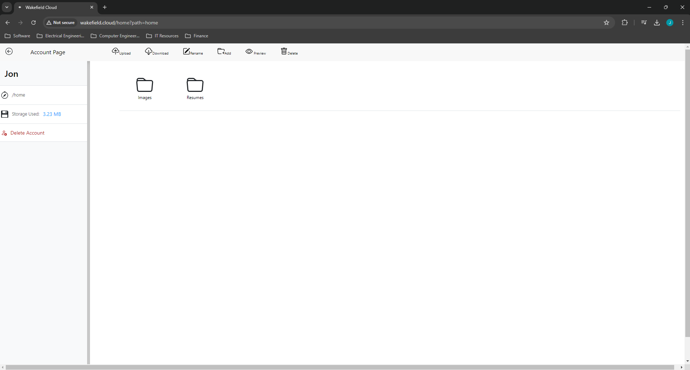

# Home Server

## Description:
Home server is a intranet cloud storage server capable of hosting & storing private files, securly on a local network all from a Raspberry Pi. 
This project uses a Vanilla JavaScript frontend, a NGINX web server, sqlite database, and a Golang backend used for file storage and retrieveal.

## Features:

- Personal Account creation
- Easy-to-use user interface
- Mobile Friendly
- sqlite Database
- File uploading and downloading
- File Previews, folder creation, and more!

## Pictures:

##### Landing Page:

##### Account Home Page:

## Installation

- This project is designed to be ran from a Raspberry Pi. However, just about any linux device should work (with some potential minor adjustments)
- Alternatively the project can be setup using docker. A docker compose file configured for Nginx and Go is provided. Note that the provided docker compose file was used on Desktop Ubuntu, not a Rasberry pi so it is possible some changes may be neccessary.

### Setup

Hardware:
- Raspberry Pi 4b 

#### Instructions
1) OS: Raspberry Pi OS Lite 64-bit Debian bookworm (no desktop environment)
2) Install NGINX: guide I used:  https://nginx.org/en/linux_packages.html#Debian
3) Setup NGINX:
    - 3a) Copy (or move) config files
        - `cp default.conf /etc/nginx/conf.d/`
        - `cp nginx.conf /etc/nginx/`
    - 3b) Move static assets:
        - `mv static /usr/share/nginx/html/`
    - 3c) (Optional) Generate SSL HTTPS certificates
        - I am generating these inside of the /etc/nginx/conf.d folder, however these can be generated else where, just ensure the default.conf is updated to point to the correct location
        1. Generate a Private Key:
            - `openssl genrsa -out key.pem 2048`

        2. Create a Certificate Signing Request (CSR):
            - `openssl req -new -key key.pem -out csr.pem`

        3. Generate the Self-Signed Certificate:
            - `openssl x509 -req -days 365 -in csr.pem -signkey key.pem -out cert.pem`

4) Install Go: 
    - I am using this Guide https://go.dev/doc/install
    - With version: go1.22.5.linux-arm64.tar.gz (`wget https://golang.org/dl/go1.22.5.linux-arm64.tar.gz`)
    - 4a) Build main
        - `go build main.go`

5) Install Sqlite3: 
    - `sudo apt install sqlite`

6) (Optional) Setup DNS host mapping to setup a name for your server (see above photos for example)
    - This process wil differ for each modme / ISP, but generally navigating to your modems Admin panel (possibly 192.168.0.1) will offer an option to complete this.

# Disclaimer
This project is designed for a secure local network. While some security measures are in place; this project is not setup to be ran in a production environment.

# License

This project is open source, feel free to use this code in your own project!

# Support and Feedback

If you encounter any issues, bugs or have suggestions for improving home server, please feel free to open an issue on GitHub. Your feedback is valuable and helps to enhance the project for all users.
